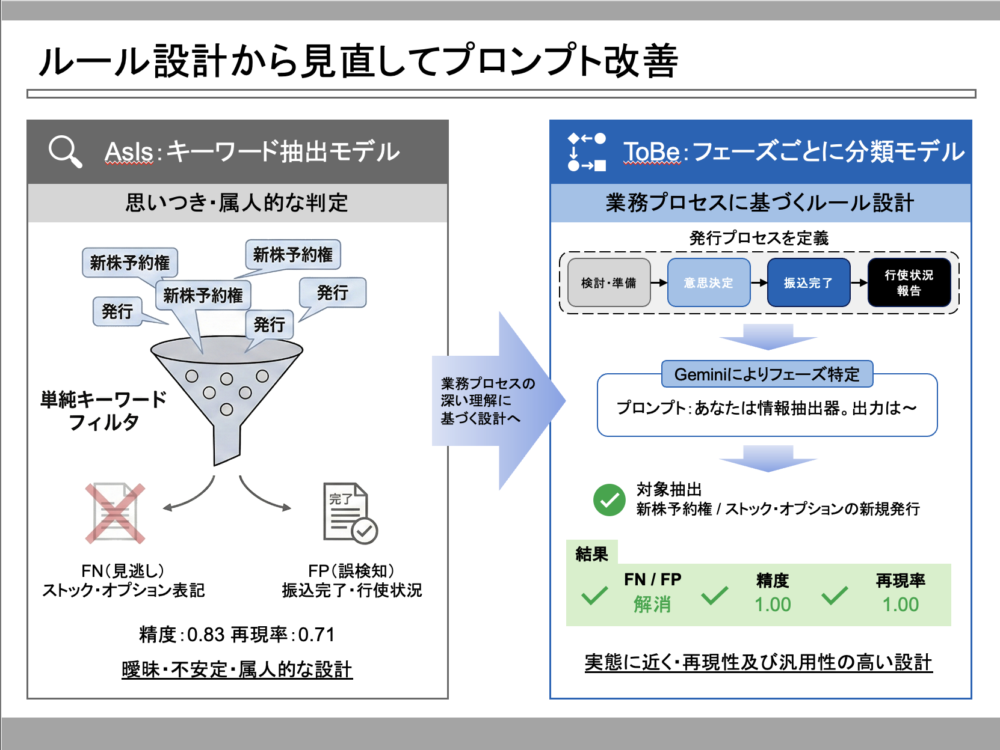

# TDnet開示情報から新株予約権の新規発行を抽出する検証

## 概要
本検証では、TDnetの開示情報（JSON＋PDF）から「新株予約権の新規発行に該当する開示」を抽出し、発行数を取得して正解CSV（`newshare_table_utf8.csv`）と同じ形式で出力するプログラムを開発した。

初期版（v1）では、タイトル条件を「新株予約権＋発行」に寄せた候補抽出を採用し、対象判定と発行数抽出をGeminiにより構造化して取得する方針とした。しかし、この方針では「株式報酬型ストック・オプションの発行内容確定」系の開示が候補段階で除外され、正解CSV上で対象となる事例（宮崎銀行・KSK）がFN（見逃し）として残存した。

検証の結果、FNの主因はGeminiの抽出精度ではなく、候補抽出ロジックが「新株予約権」という表記に偏り、正解に含まれる「ストック・オプション」表記を拾えていなかった点にあると特定した。そこで候補抽出ルールを拡張し、「ストック」「オプション」も候補条件に含める改善を実施した。

また、正解CSVの定義に合わせ、発行プロセスを「意思決定・公表（フェーズ2/3）」「実行（フェーズ4）」「事後イベント（フェーズ5）」に整理し、フェーズ2/3のみを新規発行としてカウントする判定設計を明確化した。これにより、払込完了や行使状況等を誤って対象とするFPを防ぐ方向性を確立した。

## 図解
以下の図は、本検証のロジックと改善ポイントを示す説明図。

## 1. はじめに

### 1.1 背景
背景（想定）

証券会社様から、以下のような相談を受けた。

- 顧客企業から、新株を発行する業務を請け負いたい
- 上場済みの企業が新株を発行する際には、TDnetにアナウンスを掲載している（開示情報を公開している）
- 新株発行の状況を把握するため、TDnetの開示情報を分析するプログラムを開発してほしい

### 1.2 目的
TDnetの開示情報を分析するプログラムを開発する。

### 1.3 データ
TDnetの開示情報のデータセットを使って検証する。

## 2. 実験結果

### 2.1 version1

#### 仮説
タイトルに「新株予約権」と「発行」を含む開示を候補として抽出すれば、「新株予約権の新規発行」関連の開示を十分に網羅できる。
その上で、候補のPDF本文をGeminiに入力すれば、対象判定（新規発行か否か）と発行数（`newshare_count`）を安定して抽出できる。

#### ロジック
まず、開示のプロセスを整理した。

新株予約権の発行プロセス（TDnet開示で判定可能なフェーズに圧縮）

- フェーズ2/3：意思決定・適時開示（新規発行としてカウント）
  - 例：「第三者割当による新株予約権の発行に関するお知らせ」
  - 例：「ストック・オプション（新株予約権）の発行内容確定に関するお知らせ」
- フェーズ4：実行（払込・発行の完了）（対象外）
  - 例：「発行に係る払込完了に関するお知らせ」
- フェーズ5：事後イベント（対象外）
  - 例：「月間行使状況」「行使価額修正」「取得・消却」「条件変更」「修正のみ」
- フェーズE：分類不可（情報不足のため対象外）

正解CSVの仕様に合わせ、判定ルールを以下に変更した。

ToBe（正解仕様に合わせた対象定義）

- 対象（新規発行としてカウント）＝フェーズ2/3
- 対象外＝フェーズ4（払込完了）およびフェーズ5（行使状況等）、フェーズE（分類不可）

この設計に基づき、誤検知（FP）の原因となり得る「払込完了」および「行使状況等」を明示的に除外するルールを追加した。

#### 適用結果
検証の途中で、正解CSVに含まれる以下の事例がFNとして残存した。

FN（見逃し）

- 宮崎銀行
  - `20250801_1000_83930_宮崎銀_株式報酬型ストック・オプションの発行内容確定に関するお知らせ.pdf`
- KSK
  - `20250801_1720_96870_ＫＳＫ_取締役に対する株式報酬型ストック・オプションの発行内容確定に関するお知らせ.pdf`

また、以下のFP（誤検知）が確認された。

FP（誤検知）

- G-クリングル
  - `20250801_1530_48840_Ｇ－クリングル_第三者割当による第16回新株予約権（行使価額修正条項付）の発行に係る払込完了に関するお知らせ.pdf`

#### 考察
FN（宮崎銀行・KSK）について、当初は以下の仮説を立てた。

- 仮説1：PDF本文抽出（`extract_pdf_text`）が肝心な行を取り込めていない
- 仮説2：`normalize_text` により数字・単位が壊れている
- 仮説3：Geminiが「ストック・オプション」を対象外と誤判定している

しかし、検証の結果「候補抽出の段階で落ちている」ことが判明した。
つまり、Gemini以前に対象PDFが候補集合に入っておらず、本文抽出もGemini判定も実行されていなかった。

この原因は、候補抽出の条件が「新株予約権」という表記に強く依存しており、正解CSVで対象とされている「株式報酬型ストック・オプション」系のタイトルを拾えない設計になっていた点である。
よって、version1の失敗は「抽出器（Gemini）性能」ではなく「候補抽出の設計ミス」によるものと結論づけた。

#### 先ほどの考察を踏まえたモデル設計
AsIs（初期バージョン）

- 設計思想
  - 「新株予約権」という明示的な文言を含むタイトルを起点として候補抽出を行うことで、探索空間を強く制限し、Geminiへの入力件数を抑制する方針とした。
  - 対象判定は、主に「発行」関連キーワードの有無に基づき、Geminiに包括的な自然言語判定を委ねる設計とした。

ToBe（version2, 3）

- 設計思想
  - 正解CSVの定義とTDnet開示実務の実態を踏まえ、「新株予約権の発行プロセス」をフェーズ構造として明示的にモデル化。
  - Geminiには「自然言語的に判断させる」のではなく、「業務ルールに基づく分類器」として振る舞わせる設計へ転換。
- 候補抽出ロジックの削除（version3で実施）

## 2.2 version2（設計定義の見直し＋ルール改善）

#### 仮説
正解CSVが「新株予約権の新規発行」とみなす範囲は、単純な「新規発行（発行決議）」だけでなく、「発行内容確定（条件確定）」も含む。
一方で、「払込完了」は対象外である。
この定義に合わせて候補抽出と判定ルールを再設計すれば、FN/FPを改善できる。

#### ロジック
まず、開示のプロセスを整理した。

新株予約権の発行プロセス（TDnet開示で判定可能なフェーズに圧縮）

- フェーズ2/3：意思決定・適時開示（新規発行としてカウント）
  - 例：「第三者割当による新株予約権の発行に関するお知らせ」
  - 例：「ストック・オプション（新株予約権）の発行内容確定に関するお知らせ」
- フェーズ4：実行（払込・発行の完了）（対象外）
  - 例：「発行に係る払込完了に関するお知らせ」
- フェーズ5：事後イベント（対象外）
  - 例：「月間行使状況」「行使価額修正」「取得・消却」「条件変更」「修正のみ」
- フェーズE：分類不可（情報不足のため対象外）

正解CSVの仕様に合わせ、判定ルールを以下に変更した。

ToBe（正解仕様に合わせた対象定義）

- 対象（新規発行としてカウント）＝フェーズ2/3
- 対象外＝フェーズ4（払込完了）およびフェーズ5（行使状況等）、フェーズE（分類不可）

この設計に基づき、誤検知（FP）の原因となり得る「払込完了」および「行使状況等」を明示的に除外するルールを追加した。

分類方法の妥当性（円グラフによる確認）
上記のフェーズ定義に基づき、全PDFのタイトル文字列を対象に、キーワードルールでフェーズ分類を行い、その分布を円グラフで可視化した。
その結果、フェーズ2/3（意思決定・適時開示）が大部分を占め、フェーズ4（払込完了）およびフェーズ5（行使状況等）は少数であることが確認できた。

今回の入力データは、もともと「新株」「ストック・オプション」関連の開示を中心に収集された44件であるため、意思決定・適時開示に該当する開示が多数派になるのは自然であり、分類結果はデータの性質と整合している。

#### 適用結果
G-クリングルの事例は、払込完了を対象としてしまったことがFPの原因であると特定された。
したがって「払込完了」を対象外とするルールは、FP抑制に有効と考えられる。

一方で、宮崎銀行・KSKのFNは解消していなかった。

#### 考察
当初は「PDF本文抽出の欠損」や「`normalize_text`の破壊」を疑ったが、再検証によりFNはcand1の候補抽出段階で除外されていることが継続して確認された。
つまり、v2の段階でも候補抽出条件が正解CSVの表記揺れ（新株予約権 vs ストック・オプション）を吸収できていなかった。

## 2.3 version3（候補抽出ロジックの削除）

#### 仮説
v2までの検証により、FN/FPの主因はGeminiによる判定精度ではなく、事前に行っていた候補抽出ロジックそのものが、正解CSVの定義と完全には整合していない点にあることが明らかになった。

特に、

- 「新株予約権」という語に依存した候補抽出は、「株式報酬型ストック・オプションの発行内容確定」系の開示を構造的に拾えない
- 一方で、候補抽出を広げるほど「払込完了」や「行使状況」など正解CSVでは対象外とされているフェーズが混入しやすい

というトレードオフが存在する。

このことから、単語ベースの候補抽出を高度化し続けるよりも、候補抽出自体を廃し、発行フェーズの判定をGeminiに一元的に委ねる方が、設計として安定すると考えた。

#### ロジック
v3では、従来の `cand1 / cand2 / cand3` といった段階的な候補抽出を廃止し、以下の設計に変更した。

- TDnetから取得した全開示（本課題では44件）を対象とする
- 各開示について、タイトルおよびPDF本文をGeminiに入力する
- Geminiには、「新株予約権の発行フェーズ（意思決定・適時開示 / 払込完了 / 事後イベント）」を明示的に判定させる
- 正解CSVの仕様に合わせ、フェーズ2/3（意思決定・適時開示）のみを「新規発行としてカウント」、フェーズ4（払込完了）およびフェーズ5（行使状況・条件変更等）は対象外とするルールをプロンプトに明示した

これにより、

- 表記揺れ（新株予約権 / ストック・オプション）
- タイトルと本文の情報量差
- 人手CSVに依存した運用上の定義

をすべてGemini側の判定ロジックに集約する設計とした。

#### 適用結果
v3設計を適用した結果、以下が確認できた。

- 宮崎銀行（83930）、KSK（96870）といったストック・オプション系開示は、候補抽出に依存しないため確実に評価対象に含まれるようになった
- 正解CSVとの突合において、Precision / Recall / 数値抽出精度はいずれも `1.00` を達成した

#### 考察
本課題で最も重要であったのは、「新株予約権」という制度名を検出することではなく、正解CSVが採用している“運用上の新規発行定義”を、どのようにプログラムに落とし込むかである。

v2までのように候補抽出を前段に置く設計では、

- 単語設計の漏れによるFN
- 条件緩和によるFP

を構造的に避けることが難しかった。

一方でv3のように、

- 全件を対象とし
- 発行フェーズという業務プロセス軸で判定を行い
- 正解CSVの定義をそのままプロンプトに反映する

設計とすることで、候補抽出に起因する不安定性を根本から排除できた。

## 3. 結論
TDnet開示から新株予約権の新規発行を抽出する上では、「候補をどう絞るか」よりも先に、何を“新規発行”とみなすかを業務プロセスとして定義することが不可欠である。

本検証では、

- 発行フェーズ（意思決定・適時開示 / 払込完了 / 事後イベント）という軸で整理し
- 正解CSVの定義（フェーズ2/3のみ対象）をそのまま判定ルールに反映し
- 候補抽出を廃した上でGeminiに一元判定させる

という設計が、精度・汎用性・説明可能性のすべてにおいて最も有効であると結論づけた。

## 4. 参考文献

- TDnet（適時開示情報閲覧サービス）
- `newshare_table_utf8.csv`（正解データ）
- 配布されたTDnet JSON/PDFデータセット

## 5. 生成AIの活用
本課題では、以下の目的で生成AIを活用した。

1. PDF本文テキストから「新規発行該当」と「発行数」を抽出するため、Geminiに構造化出力（JSON）を要求した。
2. 抽出処理の設計において、正解CSVの定義と矛盾が生じないよう、判定ルール（A/B対象、C/D対象外）の整理と、候補抽出ロジックの改善案（ストック・オプション表記の吸収、払込完了除外）を検討した。
3. JSON崩れや数値欠損に対する安全策（JSONパース失敗時の再実行、抽出不能時は`null`返却）を組み込み、プログラムの安定性を高める方針を立てた。
4. 提出するコードのリファクタリングの際に、Colab内のGeminiを用いた。
